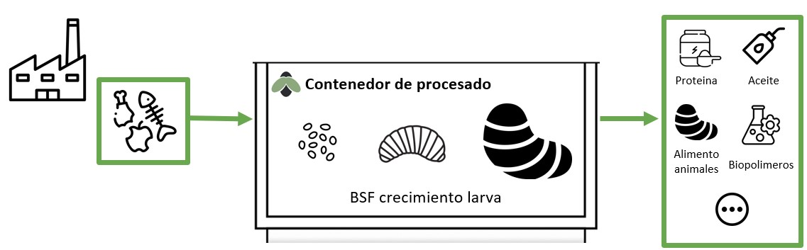

<H2>Nuestra Propuesta de Valor</H2> 

<H3>Entotech Solutions</H3>

El concepto de negocio que hemos estado validando y pivotando con el mercado se construye respecto el modelo de producción y consumo de economía circular. <strong>"Entotech Solutions" nace de la necesidad de una gestión más eficiente de los residuos orgánicos.</strong>

Nuestro objetivo es transformar la materia orgánica que se produce indirectamente durante las actividades diarias por productores alimentarios, mercados mayoristas, plantas de tratamiento... en el mismo lugar en el que se generan, y dar una segunda vida a los desechos orgánicos, convertirlos en nuevo valor para nuestra sociedad. Las aplicaciones objetivo despues de esta transformación son múltiples y aplican a diferentes areas de negocio como la alimentación animal, alimentación humana, sector médico...
 

 

<H3>Proyección del negocio</H3>

<table class="styled-table"> 
<thead>
<tr><th>Fases del negocio</th> <th>Iniciativa</th> <th>Objetivo</th> <th>Estimación de tiempo</th></tr>
</thead>
<tbody> 
<tr><td>Primera Fase</td> <td>Prueba Piloto “Procesado residuos orgánicos”</td> <td>Eficientar el proceso del crecimiento de la larva BSF*</td><td>1 Año</td></tr> 
<tr><td>Segunda Fase</td> <td>Prueba Piloto “Integración Incubadora”</td> <td>Integración vertical del proceso del cultivo moscas</td><td>2 Año</td></tr>
<tr><td>Tercera Fase</td> <td>Apertura a nuevas aplicaciones</td> <td>Cultivo  industrial, Otras aplicaciones...</td><td>3 Año</td></tr>
</tbody></table> 

